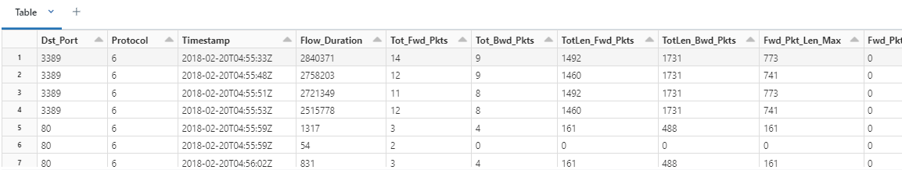
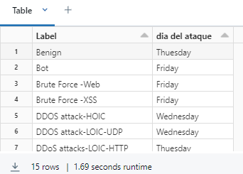
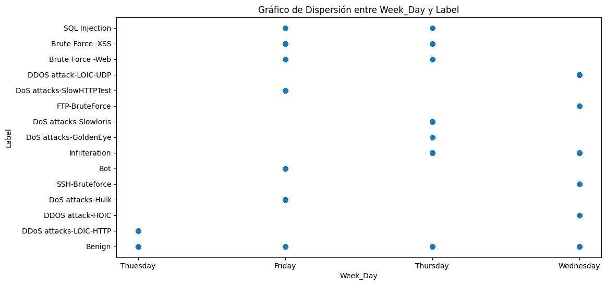
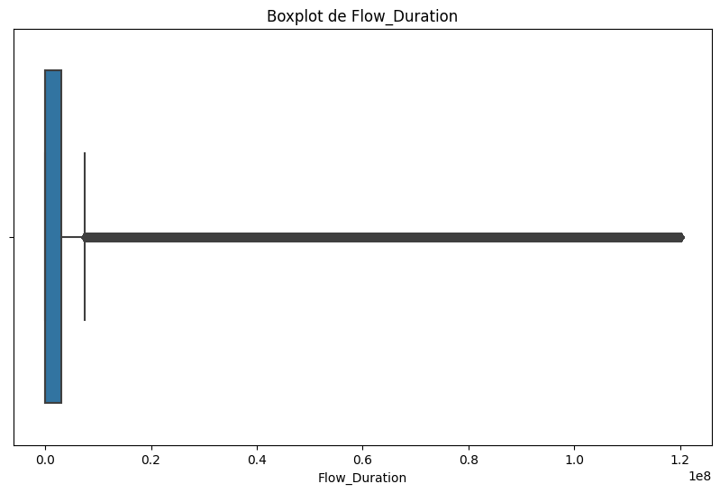
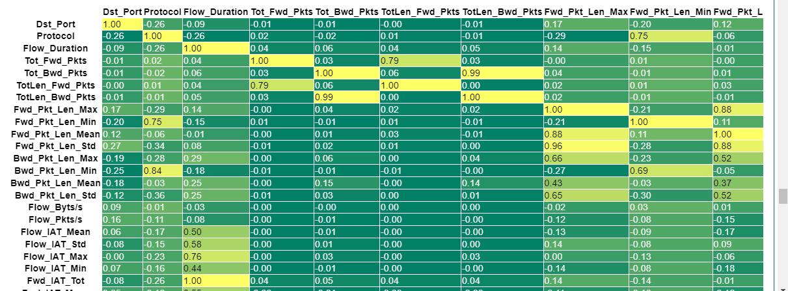

# Importar las librerias necesarias
```python
from pyspark.sql import *
from pyspark.sql.types import *
from pyspark.sql.functions import *
import matplotlib.pyplot as plt
import pyspark.sql.functions as F
from pyspark.ml.feature import *
from pyspark.ml.stat import *
from pyspark.sql.window import Window
from functools import reduce
import pandas as pd
```
## Información para acceder a Azure Storage
```python
# Información para acceder a Azure Storage
blob_account_name = ""
blob_container_name = ""
blob_origin_path = "silver"
blob_destination_path = "Golden"
blob_sas_token = r""

spark.conf.set(f'fs.azure.sas.{blob_container_name}.{blob_account_name}.blob.core.windows.net', blob_sas_token)

# Configuración de SparkSession
spark = SparkSession.builder \
    .appName("AzureBlobStorage") \
    .config(f"fs.azure.account.key.{blob_account_name}.blob.core.windows.net", "") \
    .getOrCreate()
wasbs_path = f"wasbs://{blob_container_name}@{blob_account_name}.blob.core.windows.net/"
```
1. Le indicamos a spark que lea un formato parquet
  ```python
data=spark.read.parquet(wasbs_path+blob_origin_path)
  ```
2. Vemos los datos
  ```python
display(data.limit(15))
  ```
  

```python
column_names = data.schema.names
print(column_names)

display(data.groupBy("Label").agg(F.first("Week_Day").alias("dia del ataque")))
```


## Análisis de Protocolos más Utilizados por Día de la Semana

En esta sección, creamos una ventana de partición por día de la semana y ordenamos por el recuento descendente para identificar los protocolos más utilizados. Luego, agrupamos los datos por día de la semana, etiqueta (Label) y protocolo, contamos las ocurrencias y asignamos un rango basado en el recuento. Finalmente, filtramos para obtener solo las filas con rango 1 y renombramos la columna 'Protocol' como 'protocolo_mas_usado'.

```python
windowSpec = Window().partitionBy("Week_Day").orderBy(F.desc("count"))

display(data.groupBy("Week_Day", "Label", "Protocol").count().withColumn(
    "rank", F.row_number().over(windowSpec)
).filter("rank == 1").drop("rank").withColumnRenamed("Protocol", "protocolo_mas_usado"))
```

# Visualización de Dispersión entre Week_Day y Label

En esta sección, convertimos el DataFrame de Spark a un DataFrame de Pandas para generar un gráfico de dispersión que muestre la relación entre las variables 'Week_Day' y 'Label'.

```python
# Convertir el DataFrame de Spark a Pandas
pandas_df = data.select("Week_Day", "Label").toPandas()

# Crear el gráfico de dispersión
plt.figure(figsize=(12, 6))
plt.scatter(pandas_df['Week_Day'], pandas_df['Label'], alpha=0.5)
plt.title('Gráfico de Dispersión entre Week_Day y Label')
plt.xlabel('Week_Day')
plt.ylabel('Label')
plt.show()
```


## Histograma de Frecuencias por Día de la Semana

En esta sección, filtramos los datos para incluir solo el rango de Timestamp deseado (por ejemplo, para el año 2018). Luego, encontramos los dos Label más comunes y filtramos los datos para incluir solo estos dos Label. Después, agrupamos por Week_Day y contamos la frecuencia de cada Label, y finalmente creamos un histograma para visualizar estas frecuencias por día de la semana.

```python
# Filtra los datos para incluir solo el rango de Timestamp deseado (por ejemplo, para el año 2018)
start_date = "2018-01-01"
end_date = "2018-12-31"
filtered_data = data.filter((F.col("Timestamp") >= start_date) & (F.col("Timestamp") <= end_date))

# Encuentra los 2 Label más comunes
top_labels = (
    filtered_data.groupBy("Label")
    .count()
    .orderBy(F.desc("count"))
    .limit(3)
    .select("Label")
    .rdd.flatMap(lambda x: x)
    .collect()
)

# Filtra los datos para incluir solo los 2 Label más comunes
filtered_data = filtered_data.filter(F.col("Label").isin(top_labels))

# Agrupa por week_day y cuenta la frecuencia de cada Label
histogram_data = (
    filtered_data.groupBy("Week_Day", "Label")
    .count()
    .groupBy("Week_Day")
    .pivot("Label")
    .agg(F.first("count"))
    .na.fill(0)
)

# Convierte a Pandas DataFrame para visualización con matplotlib
pd_data = histogram_data.toPandas()

# Grafico de histograma
bar_width = 0.35
fig, ax = plt.subplots(figsize=(12, 6))

labels = pd_data["Week_Day"]
bar1 = ax.bar(labels, pd_data[top_labels[0]], bar_width, label=top_labels[0])
bar2 = ax.bar(labels, pd_data[top_labels[1]], bar_width, label=top_labels[1], bottom=pd_data[top_labels[0]])

ax.set_title("Histograma de Frecuencias por Día de la Semana")
ax.set_xlabel("Week_Day")
ax.set_ylabel("Frecuencia")
ax.legend()

plt.show()
```


## Exploremos nulls
```pyhon
# Contar los valores nulos en cada columna
null_counts = [(col_name, data.filter(col(col_name).isNull()).count()) for col_name in data.columns if data.filter(col(col_name).isNull()).count() > 0]

# Imprimir los recuentos
for col_name, count in null_counts:
    print(f"La columna '{col_name}' tiene {count} valores nulos.")
```
# Identifiquemos valores **atipicos**
```python
# Convierte el DataFrame de PySpark a un DataFrame de pandas
pandas_df = data.select('Flow_Duration').toPandas()

# Crea el boxplot con seaborn
plt.figure(figsize=(10, 6))
sns.boxplot(x='Flow_Duration', data=pandas_df)
plt.title('Boxplot de Flow_Duration')
plt.show()
```


# Analisis de Correlación y Filtrado de datos:

Este código realiza las siguientes tareas:
* Convierte ciertas columnas del DataFrame data al tipo de datos integer.
* Selecciona un subconjunto de columnas del DataFrame resultante y lo almacena en dfCorr.
* Indexa la columna "Label" para transformarla en un valor numérico y la añade al DataFrame dfCorr.
* Filtra los datos para eliminar valores nan, inf y -inf.
* Crea un vector de características usando VectorAssembler.
* Calcula la matriz de correlación de las características.
* Convierte la matriz de correlación a un DataFrame de Pandas para su visualización.

```python
# Convertir las columnas "Dst_Port" y "Protocol" al tipo de datos "integer"
Corr = data.withColumn("Dst_Port", col("Dst_Port").cast("integer")).withColumn("Protocol", col("Protocol").cast("integer"))

# Seleccionar las columnas deseadas
dfCorr = Corr.select(column_names)

# Indexar la columna "Label" y transformarla en una columna numérica llamada "Ataque"
indexed_df = StringIndexer(inputCol="Label", outputCol="Ataque").fit(dfCorr).transform(dfCorr)

new=['Dst_Port', 'Protocol', 'Flow_Duration', 'Tot_Fwd_Pkts', 'Tot_Bwd_Pkts', 'TotLen_Fwd_Pkts', 'TotLen_Bwd_Pkts', 'Fwd_Pkt_Len_Max', 'Fwd_Pkt_Len_Min', 'Fwd_Pkt_Len_Mean', 'Fwd_Pkt_Len_Std', 'Bwd_Pkt_Len_Max', 'Bwd_Pkt_Len_Min', 'Bwd_Pkt_Len_Mean', 'Bwd_Pkt_Len_Std', 'Flow_Byts/s', 'Flow_Pkts/s', 'Flow_IAT_Mean', 'Flow_IAT_Std', 'Flow_IAT_Max', 'Flow_IAT_Min', 'Fwd_IAT_Tot', 'Fwd_IAT_Mean', 'Fwd_IAT_Std', 'Fwd_IAT_Max', 'Fwd_IAT_Min', 'Bwd_IAT_Tot', 'Bwd_IAT_Mean', 'Bwd_IAT_Std', 'Bwd_IAT_Max', 'Bwd_IAT_Min', 'Fwd_PSH_Flags', 'Bwd_PSH_Flags', 'Fwd_URG_Flags', 'Bwd_URG_Flags', 'Fwd_Header_Len', 'Bwd_Header_Len', 'Fwd_Pkts/s', 'Bwd_Pkts/s', 'Pkt_Len_Min', 'Pkt_Len_Max', 'Pkt_Len_Mean', 'Pkt_Len_Std', 'Pkt_Len_Var', 'FIN_Flag_Cnt', 'SYN_Flag_Cnt', 'RST_Flag_Cnt', 'PSH_Flag_Cnt', 'ACK_Flag_Cnt', 'URG_Flag_Cnt', 'CWE_Flag_Count', 'ECE_Flag_Cnt', 'Down/Up_Ratio', 'Pkt_Size_Avg', 'Fwd_Seg_Size_Avg', 'Bwd_Seg_Size_Avg', 'Fwd_Byts/b_Avg', 'Fwd_Pkts/b_Avg', 'Fwd_Blk_Rate_Avg', 'Bwd_Byts/b_Avg', 'Bwd_Pkts/b_Avg', 'Bwd_Blk_Rate_Avg', 'Subflow_Fwd_Pkts', 'Subflow_Fwd_Byts', 'Subflow_Bwd_Pkts', 'Subflow_Bwd_Byts', 'Init_Fwd_Win_Byts', 'Init_Bwd_Win_Byts', 'Fwd_Act_Data_Pkts', 'Fwd_Seg_Size_Min', 'Active_Mean', 'Active_Std', 'Active_Max', 'Active_Min', 'Idle_Mean', 'Idle_Std', 'Idle_Max', 'Idle_Min', 'Ataque']
df = indexed_df.select(new)

# Lista de condiciones para cada columna
conditions = [~col(c).isin(float("nan"), float("inf"), float("-inf")) for c in new]

# Uso de reduce para combinar todas las condiciones mediante el operador AND (&)
combined_condition = reduce(lambda x, y: x & y, conditions)

# Filtrar el DataFrame utilizando la condición combinada
filtered_df = df.filter(combined_condition)

# Mostrar el recuento de filas resultantes
filtered_count = df.count()
print(f"Recuento de filas después de aplicar el filtro: {filtered_count}")

# convert to vector column first
vector_col = "corr_features"
assembler = VectorAssembler(inputCols=filtered_df.columns, outputCol=vector_col)
df_vector = assembler.transform(filtered_df).select(vector_col)

# get correlation matrix
matrix = Correlation.corr(df_vector, vector_col)

matrix.collect()[0]["pearson({})".format(vector_col)].values

matrix = Correlation.corr(df_vector, 'corr_features').collect()[0][0] 
corr_matrix = matrix.toArray().tolist() 
corr_matrix_df = pd.DataFrame(data=corr_matrix, columns = new, index=new) 
```
## Graficamos la matriz de correlacion
```python
corr_matrix_df .style.background_gradient(cmap='summer').set_precision(2)
```


# Nueva data 
Este código realiza varias operaciones en un DataFrame llamado ‘df’. Primero, obtiene los nombres de las columnas del DataFrame. Luego, filtra el DataFrame según una condición combinada y almacena el resultado en una nueva variable llamada ‘Data’. Después, define una lista de nuevas columnas que se seleccionarán del DataFrame ‘Data’. Finalmente, muestra el DataFrame ‘Data’ con las nuevas columnas seleccionadas.
```python
# Obtiene la lista de nombres de las columnas del DataFrame 'df'
column_names = df.columns

# Filtra el DataFrame 'df' utilizando una condición combinada y almacena el resultado en 'Data'
Data = df.filter(combined_condition)

# Define una lista de nuevas columnas que se seleccionarán del DataFrame 'Data'
new_columns = [
    "Protocol",
    "Fwd_Pkt_Len_Max",
    "Fwd_Pkt_Len_Min",
    "Fwd_Pkt_Len_Mean",
    "Fwd_Pkt_Len_Std",
    "Bwd_Pkt_Len_Max",
    "Bwd_Pkt_Len_Min",
    "Bwd_Pkt_Len_Mean",
    "Flow_Pkts/s",
    "Fwd_Pkts/s",
    "Bwd_Pkts/s",
    "Pkt_Len_Min",
    "Pkt_Len_Max",
    "Pkt_Len_Mean",
    "Pkt_Len_Std",
    "PSH_Flag_Cnt",
    "Pkt_Size_Avg",
    "Fwd_Seg_Size_Avg",
    "Bwd_Seg_Size_Avg",
    "Init_Fwd_Win_Byts",
    "Init_Bwd_Win_Byts",
    "Fwd_Seg_Size_Min",
    "Ataque"
]

# Selecciona las nuevas columnas del DataFrame 'Data'
Data = Data.select(new_columns)

# Muestra el DataFrame 'Data'
display(Data)
```

# Guardar en formato delta

## ¿Qué es Delta?

Delta es una capa de almacenamiento de código abierto que proporciona fiabilidad a los lagos de datos. Delta Lake es un software de código abierto que extiende los archivos de datos Parquet con un registro de transacciones basado en archivos para transacciones ACID y manejo de metadatos escalable. Delta Lake es totalmente compatible con las API de Apache Spark.

## ¿Cómo funciona Delta?

Delta Lake fue desarrollado para una integración estrecha con Structured Streaming, lo que te permite utilizar fácilmente una única copia de datos para operaciones de procesamiento por lotes y en tiempo real, proporcionando procesamiento incremental a escala. El registro de transacciones de Delta Lake tiene un protocolo abierto bien definido que puede ser utilizado por cualquier sistema para leer el registro.

## ¿Por qué usar Delta para almacenar datos?

Hay varias razones para usar Delta para almacenar datos:

1. **Transacciones ACID**: Delta proporciona transacciones ACID, lo que significa que puedes realizar operaciones de lectura y escritura en tus datos de manera segura.
2. **Manejo escalable de metadatos**: Delta puede manejar metadatos a gran escala, lo que es útil cuando se trabaja con grandes volúmenes de datos.
3. **Unificación de procesamiento de datos por lotes y en tiempo real**: Con Delta, puedes utilizar una única copia de datos para operaciones de procesamiento por lotes y en tiempo real.
4. **Fiabilidad**: Delta trae fiabilidad a los lagos de datos.
5. **Caché Delta**: Delta mantiene copias locales (archivos) de datos remotos en los nodos de trabajo. Esto solo se aplica a los archivos Parquet (pero Delta está hecho de archivos Parquet). Evitará lecturas remotas durante grandes cargas de trabajo.
[io](https://delta.io/)

```python
Data.write.format("delta").mode("append").partitionBy("Ataque").save(wasbs_path + blob_destination_path)
```
