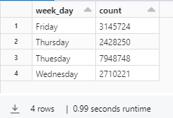
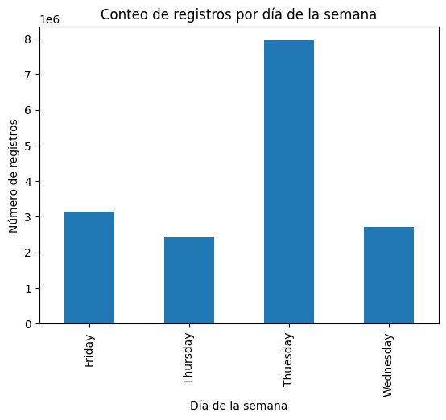

# 1. Importamos las librerias necesarias
```python
from pyspark.sql import *
from pyspark.sql.types import *
from pyspark.sql.functions import *
```

# Información para acceder a Azure Storage
```python
blob_account_name = "Nombre de la cuenta"
blob_container_name = "nombre del contenedor"
blob_origin_path = "bronze" #La carpeta de donde leeremos los datos
blob_destination_path = "silver" #carpeta donde guardaremos los datos
blob_sas_token = r""
spark.conf.set(f'fs.azure.sas.{blob_container_name}.{blob_account_name}.blob.core.windows.net', blob_sas_token)

# Configuración de SparkSession
spark = SparkSession.builder \
    .appName("AzureBlobStorage") \
    .config(f"fs.azure.account.key.{blob_account_name}.blob.core.windows.net", "") \
    .getOrCreate()
wasbs_path = f"wasbs://{blob_container_name}@{blob_account_name}.blob.core.windows.net/"

datos = spark.read.parquet(wasbs_path+blob_origin_path)

display(datos.limit(100))
```
## Modificación de nombres de columnas y adición de columna "Week_Day"

```python
from pyspark.sql import functions as F

# Obtener los nombres de las columnas originales
columnas_originales = datos.columns

# Crear un nuevo DataFrame con los nombres de columnas modificados
df_test = datos
for col_name in columnas_originales:
    new_col_name = col_name.replace(" ", "_")
    df_test = df_test.withColumnRenamed(col_name, new_col_name)

# Añadir la columna "Week_Day"
df_test = df_test.withColumn("Week_Day", F.split(F.col("date"), "-")[0])

display(df_test)

column_names = df_test.schema.names
print(column_names)

#Declaramos columns para especificar las columnas que nos interesan
Columns = [
   'Dst_Port', 'Protocol', 'Timestamp', 'Flow_Duration', 'Tot_Fwd_Pkts', 'Tot_Bwd_Pkts', 'TotLen_Fwd_Pkts', 'TotLen_Bwd_Pkts', 'Fwd_Pkt_Len_Max', 'Fwd_Pkt_Len_Min',
   'Fwd_Pkt_Len_Mean', 'Fwd_Pkt_Len_Std', 'Bwd_Pkt_Len_Max', 'Bwd_Pkt_Len_Min', 'Bwd_Pkt_Len_Mean', 'Bwd_Pkt_Len_Std', 'Flow_Byts/s', 'Flow_Pkts/s', 'Flow_IAT_Mean',
 'Flow_IAT_Std', 'Flow_IAT_Max', 'Flow_IAT_Min', 'Fwd_IAT_Tot', 'Fwd_IAT_Mean', 'Fwd_IAT_Std', 'Fwd_IAT_Max', 'Fwd_IAT_Min', 'Bwd_IAT_Tot', 'Bwd_IAT_Mean', 'Bwd_IAT_Std',
'Bwd_IAT_Max', 'Bwd_IAT_Min', 'Fwd_PSH_Flags', 'Bwd_PSH_Flags', 'Fwd_URG_Flags', 'Bwd_URG_Flags', 'Fwd_Header_Len', 'Bwd_Header_Len', 'Fwd_Pkts/s', 'Bwd_Pkts/s', 'Pkt_Len_Min',
 'Pkt_Len_Max', 'Pkt_Len_Mean', 'Pkt_Len_Std', 'Pkt_Len_Var', 'FIN_Flag_Cnt', 'SYN_Flag_Cnt', 'RST_Flag_Cnt', 'PSH_Flag_Cnt', 'ACK_Flag_Cnt', 'URG_Flag_Cnt', 'CWE_Flag_Count',
'ECE_Flag_Cnt', 'Down/Up_Ratio', 'Pkt_Size_Avg', 'Fwd_Seg_Size_Avg', 'Bwd_Seg_Size_Avg', 'Fwd_Byts/b_Avg', 'Fwd_Pkts/b_Avg', 'Fwd_Blk_Rate_Avg', 'Bwd_Byts/b_Avg', 'Bwd_Pkts/b_Avg',
 'Bwd_Blk_Rate_Avg', 'Subflow_Fwd_Pkts', 'Subflow_Fwd_Byts', 'Subflow_Bwd_Pkts', 'Subflow_Bwd_Byts', 'Init_Fwd_Win_Byts', 'Init_Bwd_Win_Byts', 'Fwd_Act_Data_Pkts', 'Fwd_Seg_Size_Min',
 'Active_Mean', 'Active_Std', 'Active_Max', 'Active_Min', 'Idle_Mean', 'Idle_Std', 'Idle_Max', 'Idle_Min', "Label", "Week_Day"
]
#Filtramos el dataset
df_test = df_test.select(Columns)

```

## Escribimos en formato parquet

```python
df_test.write.format("parquet").mode("append").partitionBy("Label").save(wasbs_path+blob_destination_path)
display(dbutils.fs.ls(wasbs_path+blob_destination_path))
```

### Mini exploración de datos

```python
display(df_test.groupBy("week_day").count())
```
  

```python
import pandas as pd
import matplotlib.pyplot as plt

# Agrupa por la columna "week_day" y cuenta el número de registros
grouped_data = df_test.groupBy("week_day").count()

# Convierte el resultado a un DataFrame de pandas
pandas_df = grouped_data.toPandas()

# Grafica de barras
pandas_df.plot(kind='bar', x='week_day', y='count', legend=False)
plt.xlabel('Día de la semana')
plt.ylabel('Número de registros')
plt.title('Conteo de registros por día de la semana')
plt.show()
```
  
